## **Project Title : Predicting Health Insurance Premium using Regression Model with Age and Gender Detection from Image using CNN**

## Group Members

1. Aman Valera @ amanvalera7
2. Sai Ruthik Katta @ SaiRuthik
3. Samarth Rathi @ SamarthRathiH00422752
4. Suhashini Selvaraj @ Suhashini-Selvaraj

## Initial Project Proposal

* The Aim of this project is to develop a user friendly system which predicts how much Health Insurance a person might have to pay. It comprises of two parts:

* **Estimating Health Insurance:** This is the initial objective on which we will be focusing. The input data is a person's basic information such as Age, Gender, Residing location etc.,. Using a suitable Algorithm, our Machine Learning model will predict the estimate a person has to pay as an Health Insurance using the required Features. We aim to predict this a bit more accurately which helps the people to get right insurance deals.

* **Predicting who you are:** The second segment of this project focuses on predicting the basic data of a person based on his/her photo. We use Convolution Neural Networks to determine the Age and Gender based on the provided image of the person.

* Combining these two aspects would result in an easy-to-use platform that tells how much insurance might cost and help insurance companies understand you in a better way. We try to simplify the health insurance process and make it more personalized.

### Research objectives
How accurately can we predict health insurance charges based on attributes using traditional regression modeling techniques?

What is the effectiveness of an Convolution Neural Network (CNN) model in predicting demographic attributes such as age and gender?

How can image processing techniques be integrated into the system to extract attributes from images for accurate premium estimation?

### Milestones

* **Data collection and preprocessing:** Fix missing values and organise the format of the data to create the two datasets prepared for analysis.
* **Ethical Consideration of Dataset:** Data used for this project is public and ethically cleared to use. The license of the datasets has been updated in the [dataset section](README.md#datasets).
* **Clustering Analysis:** Using clustering algorithms, divide policyholders into groups according to common features and demographic characteristics.
* **Data Visualization:** Utilize visualizations to gain insights into the dataset's patterns and relationships among variables.
* **Development of Regression Models:** Create a prediction model to calculate insurance costs according to policyholder data.
* **Fine-Tuning and Optimisation:** Enhance the system's overall performance, resilience, and accuracy.
* **CNN Model Training:** Using the demographic dataset, train an CNN model to predict demographic features.
* **System Integration:** To build an integrated health insurance prediction system, integrate the image processing skills, and predictive models.
* **Testing and Validation:** In order to ensure precise premium calculation, test the system's functionality using a variety of picture inputs and real-world circumstances.

# Prerequisites
Note: These following pre-requisites is based on this respository and project.
  * For Regression (Health Insurance Prediction) any general setup like [google colab](https://colab.research.google.com/) can be used, but for CNN to avoid epoch processing time a local setup of anaconda might be required. The following steps will guide for the same.

* **Python Version :**
1. For Insurance Premium Prediction: 3.10.12
2. For CNN: 3.7.16 --->To avoid any complications during the installation of TensorFlow with local GPU support.
* **Anaconda Version: 22.9.0**
 ---> To install Ananconda, clcik on this link: [Download Ananconda](https://www.anaconda.com/download)
* **Note** : Create a local environmnet in anaconda and then install the pre-requisite libraries below.
* Packages and versions: [Python Installed Packages](./documentation/requirements.txt)
* To use local GPU for CNN follow this link: [Using Local GPU with Tensorflow Guide](https://www.tensorflow.org/install/pip)

**Important Point**
* To run the CNN model directly inside the [regression code](./notebook/code.ipynb), a model file is upload on [OneDrive](https://heriotwatt-my.sharepoint.com/:u:/g/personal/sr2077_hw_ac_uk/EW4-ohf0bHpBqu9zU7JSGaABOZK_r5ZXZnNFPrBUMGfhbg?e=hpCT6Y) and a zip file is also uploaded inside the project directory : [Cnn_Model.zip](./notebook/Cnn_Model.zip). You can download the file from OneDrive (if incase the zip file causes some issue) and then save it in the same directory as the 'code.ipynb' file.
Anyone with the Heriot-Watt Email ID can access the CNN Model.

### DISCLAIMER
**NOTE : [ChatGpt-3.5](https://chat.openai.com/) was used to develop undersatnding for the project and few algorithms but 'NO' code or data was copied from ChatGpt.**

## Findings Report

<!-- Below you should report all of your findings in each section. You can fill this out as the project progresses. -->

### Research objectives
<!-- What questions you are trying to answer? -->
1. **Assess Predictive Accuracy:**
* Using standard regression models, assess the precision of health insurance charge estimates.
* Examine how  attributes affect premium estimation accuracy.
2. **Analyse the effectiveness of CNNs:**
* Analyse the predictive power of an Convolution Neural Network (CNN) model in predicting demographic variables (such as age and gender).
* To improve effectiveness, investigate fine-tuning CNN model.
3. **Image Processing Integration:**
* Look into incorporating image processing techniques into the system design.
* Investigate advanced image processing techniques for obtaining user attributes from images.

4. **Integrate Regression and CNN Models:**
* Investigate the relationship between classical regression models and Convolutional Neural Networks (CNNs) for predicting health insurance rates.
* Investigate the idea of using CNNs to extract demographic variables (such as age and gender) from image.
* Examine the effect of image processing on premium estimating accuracy.
* Combine demographic data from CNNs with user-provided information to improve the overall automation and precision of premium forecasts.

## Datasets
Dataset 1 :  [Health Insurance Premium dataset](https://www.kaggle.com/datasets/simranjain17/insurance/data)
* License : [CC0: Public Domain](https://creativecommons.org/publicdomain/zero/1.0/)

#### Dataset description
<!-- Briefly describe your task and dataset -->
In regards tot his dataset we will predict the insurance premium i.e., charges based on other independent features age, sex, bmi, children, smoker, and region.
* We will clean and visualise the dataset.
* Next, will proceed towards Clustering to see what features we can use to make our labels and then visualise that as well.
* After that, we will proceed towards the machine learning - modelling part.

The aim is to train and test few models like Linear Regression, Descision tree, Random Forest etc., by creating pipeline to maintain ease of code making it modular and then
compare the performance of each thorugh Mean Squared Error and R2-Score, and select the best one in the end. Also, we plan on using hyperpaprameter tuning through GridSearchCV so that we get best parameters for out models.

* **The data card for this dataset is**:
1. **age**: It has age ranging from 19 to 82. It is Numerical data type denoting the age of the individuals.
2. **sex**: A categorical variable with two unique values - Male and Female defining the gender of the individuals.
3. **bmi**: The Body Mass Index being numerical continuous variable. Based on the height and weight of an individual the body fat is calculated giving the BMI.
4. **children**: A numerical variable with unique values from 0 to 5. This shows how many childrens does an individual have.
5. **smoker**: A categorical variable with 2 unique values telling if a person is a smoker or not through 'yes' or 'no'.
6. **region**: Categorical variable with 4 unique values as 'southwest', 'southeast', 'northwest', 'northeast'.
7. **charges**: A numerical variable showing the Health Insurance Premium amount charged as premium coverage.

**Independent Features**: Age, Sex(Gender), BMI, Children, Smoker and Region.

**Target Variable** : Charges

### Dataset example
<!-- Add a couple of example instances and the dataset format -->
| index | age  | sex    | bmi   | children | smoker | region     | charges    |
|-------|------|--------|-------|----------|--------|------------|------------|
| 0     | 19.0 | female | 27.9  | 0.0      | yes    | southwest  | 16884.92400|
| 1     | 18.0 | male   | 33.77 | 1.0      | no     | southeast  | 1725.55230 |
| 2     | 28.0 | male   | 33.0  | 3.0      | no     | southeast  | 4449.46200 |
| 3     | 33.0 | male   | 22.705| 0.0      | no     | northwest  | 21984.47061|
| 4     | 32.0 | male   | 28.88 | 0.0      | no     | northwest  | 3866.85520 |

Dataset 2 (zip file):  [UTKFace](https://www.kaggle.com/datasets/jangedoo/utkface-new)
**Note**: anyone with the Heriot-Watt Email Id can access this extracted dataset folder: [UTKFace](https://heriotwatt-my.sharepoint.com/:f:/g/personal/sr2077_hw_ac_uk/El3TPkVlWohIhPV6F0jp08sBq65XPyJvcRl0jwMcKFngCQ)
* License : [Data files © Original Authors](https://susanqq.github.io/UTKFace/)

#### Dataset description
Using this dataset, we'll apply CNN to predict age and gender from a person's facial image. We incorporate these demographics from a new image into our regression model after getting them from a new image. Details such as BMI, number of children, smoking status, and region are gathered from user input. Based on these combined variables, the regression model estimates the insurance premium.

* **The data card for this dataset is**:
1. **age**: It has age ranging from 19 to 82. It is Numerical data type denoting the age of the individuals.
2. **gender**: A categorical variable with two unique values - Male and Female defining the gender of the individuals.
3. **ImageName**: image file name.

### Dataset example
| Age | Gender | ImageName                                   |
|-----|--------|--------------------------------------------|
| 100 | 0      | 100_0_0_20170112213500903.jpg.chip.jpg     |
| 100 | 0      | 100_0_0_20170112215240346.jpg.chip.jpg     |
| 100 | 1      | 100_1_0_20170110183726390.jpg.chip.jpg     |
| 100 | 1      | 100_1_0_20170112213001988.jpg.chip.jpg     |
| 100 | 1      | 100_1_0_20170112213303693.jpg.chip.jpg     |

Here, the file name format consists of age, gender, ethnicity (not used for our project).
For eg., 100_0_0_20170112213500903.jpg ---> Age:100, Gender: Male, image Name: 20170112213500903.jpg.chip.jpg

## Dataset exploration
<!-- What is the size of the dataset? -->
* **Dataset 1** has 2038 Rows and 7 Columns (as mentioned in [data card](README.md#dataset-description) above)
* **Dataset 2** has 23708 rows in total with 3 columns ([as seen above](README.md#dataset-example-1)).

<!-- Train,validation,splits? -->
<!-- Summary statistics of your dataset -->
## [Data Exploration](./notebooks/code.ipynb#Data-Exploration)

Here, we tried to understand the data. Hence we used some inbuilt functions to explore it. Such as:
* **.shape**, which shows the dimensions of the dataset as a tuple. In our case, output is (2038, 7) as mentioned above .
* **.columns**, which displays the names of the features in an oredrly fashion. These have been mentioned above in the [data card](README.md#dataset-description).
* **.dtypes**, which outputs the data types of each feature adjacent to the feature name.
* **.unique()**, this function displays the unique values in each feature. We displayed them in a readable way.
* **value_counts()**, this function displays the count of each unique values in each feature. We displayed them in a readable format.
* **describe()**, this function displays the statistical characterstics. It is shown below:

| Statistic | Age | BMI | Children | Charges |
|-----------|-----|-----|----------|---------|
| Count     | 2038| 2038| 2038     | 2038    |
| Mean      | 43.81| 32.05| 1.55    | 22870.50|
| Std       | 17.72| 8.18 | 1.53    | 20415.32|
| Min       | 18   | 15.96| 0       | 1121.87 |
| 25%       | 29   | 26.22| 0       | 6552.58 |
| 50%       | 43   | 31.13| 1       | 13399.57|
| 75%       | 56   | 36.96| 3       | 38448.10|
| Max       | 88   | 53.13| 5       | 63770.43|
(Stratos Idreos, Papaemmanouil, & Chaudhuri, 2015)

The above is the statistics table of **Health Insurance Premium Dataset**. Here, we can see that various statistics have been analysed, such as:
1. Count: Showing the number of data points in ecah feature, which is same for all as we have same number of rows in all features.
2. Mean: It indicates the average of the values in that respective feature. Might be useful for the BMI feature.
3. Std: It is the standard Deviation of the values. Might be useful for the Age feature.
4. Min and Max: Shows the minimum and maximum values in each feature. Helps in normalization of the features.
5. 25%, 50%, 75%: These are 25, 50 and 75 percentile values in each feature. Helps in outlier detecton. (Zuur, Ieno, & Elphick, 2010)

## [Data Wrangling](./notebooks/code.ipynb#Data-Wrangling)
1. For dataset 1, we have chnaged the intial sex column to gender and also mapped Male as 0 and female as 1, to match with the CNN part of the code. This would help in smooth integration of both the parts. Furthermore, we have mapped smoker column Yes to 1 and No to 0 and similarly for region --->'southwest': 1, 'southeast': 2, 'northwest': 3, 'northeast': 4.
This overall mapping of gender, smoker and region is done to convert the categorical variables to numerical variables for easy processing and model training such that we get the correct prediction of premium charges.

2. Next, we check for null values in the dataset, but upon exploration it is found that the dataset has no null values for any of the 7 columns. To keep the uniformity of data we convert age, children, smoker to integer values, and bmi and charges to two decimal values.

3. After this we create a new column called adult-group, where we categorise age based on three age bins, that are:
* Age 18 to 32 : young
* Age 32 to 48 : middle-aged
* Age 48 to 88 : old

4. Added another column titled 'bmi_weight_label'. This column tells us that if a person is Underweight, Normal Weight, Overweight or Obese. The calculation used for the creation of this column, as mentioned in NHS inform (n.d.), is:
* Underweight: BMI is less than 18.5
* Normal weight: BMI is 18.5 to 24.9
* Overweight: BMI is 25 to 29.9
* Obese: BMI is 30 or more

5. Creating a column charge_average, which tells is created by finding the average value of the "charges" where the "bmi_weight_label" is "Obese". After this it labels them as Above Avg or below Avg based on where the result of the mean for the charges of that particluar row falls.

6. One more new column : Stress Level, is added using the calculation ---> BMI + Children / Age. This is applies to the dataset and in the end, the stress level for each individual is calculated.

**After Data Wrangling the dataset looks like this:**

| age | gender | bmi   | children | smoker | region | charges  | adult_group  | bmi_weight_label | charge_average | stress      |
|-----|--------|-------|----------|--------|--------|----------|--------------|------------------|----------------|-------------|
| 19  | 1      | 27.90 | 0        | 1      | 1      | 16884.92 | young        | Overweight       | Below Avg       | 0.000000    |
| 18  | 0      | 33.77 | 1        | 0      | 2      | 1725.55  | young        | Obese            | Below Avg       | 0.533017    |
| 28  | 0      | 33.00 | 3        | 0      | 2      | 4449.46  | young        | Obese            | Below Avg       | 2.545455    |
| 33  | 0      | 22.70 | 0        | 0      | 3      | 21984.47 | middle-aged  | Normal Weight    | Below Avg       | 0.000000    |
| 32  | 0      | 28.88 | 0        | 0      | 3      | 3866.86  | middle-aged  | Overweight       | Below Avg       | 0.000000    |

<!-- Visualisations of your dataset -->
## Data Visualisation
### Health Insurance Dataset
* **Scatter Plots** : Higher charges are associated with Higher BMI levels, according to both scatter plots. One [scatter plot](./Results/Visualization/ScatterPlot_BMIvsCharges_AdultGroup.png) displays the distribution of adult groups, while the [other](./Results/Visualization/ScatterPlot_BMIvsCharges_Stress.png) depicts the distribution of stress levels.

* **[The Count Plot](./Results/Visualization/CountPlot_BMIGroup_Smoker.png)** indicates that the majority of individuals fall into the ‘Overweight’ category, with non-smokers being the most prevalent in each BMI weight group.

* The **Regression line** indicates that insurance charges tend to increase with age, showing a positive correlation.

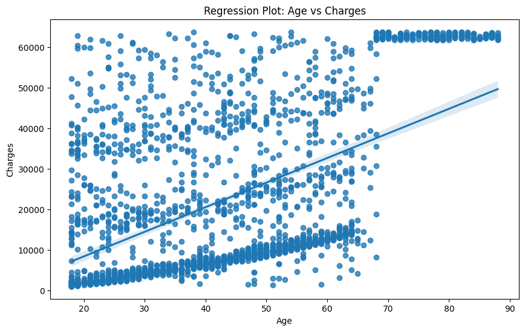

* The **[Bar Plot](./Results/Visualization/Barplot%20smoker%20vs%20non-smokers.png)** illustrates health insurance costs for smokers and non-smokers, considering the number of children. **Main insights:** Smokers face higher charges, and having more children is associated with increased costs, indicating a significant difference.

* The box plots show the median, quartiles, and outliers for the [independent features](README.md#dataset-description). Some factors have more variation and influence than others. For example, smoker and charges have a lot of outliers, indicating that smoking and high charges are not common among the customers.

* **More analysis using Box Plot :** It can be seen that the median insurance charge is highest for the obese group and lowest for the underweight group. Furthermore, **[Box Plot](./Results/Visualization/BoxPlot_BMIGroup_Charges_Stress.png)** indicates that the obese group has the highest stress metric, while the underweight group has the lowest.

 **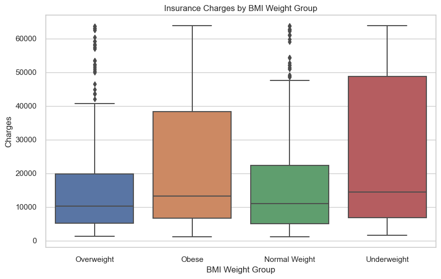**

* These **[Distribution plots](./Results/Visualization/Distribution%20Plots)** reveals how Age, Gender, BMI, Children, Smoker, Region, Charges, and Stress are spread out, helping identify their shape, center, spread, and any outliers or unusual values.

* The **stacked bar** plot visually reveals the link between smoking habits and insurance costs. The **[Count plot](./Results/Visualization/Count%20plot%20for%20age%20groups(smokers%20vs%20non-smokers).png)** illustrates age-wise smoker distribution, emphasizing more young and old smokers. Additionally, the associated **[violin plot](./Results/Visualization/ViolinPlot_Charges_Children_for_Smoker.png)** highlights higher charges for smokers across all categories of the number of children.

### **CNN UTK Face Data Visualisation**
While Visualising the data and images for UTKFace dataset, we have used few plots to make the understanding of data more refined. Here below are the few pointers and observations done:

* **[Histogram Plot and Bar Plot](./Results/Visualization/Histogram%20and%20Bar%20plot%20for%20age%20and%20gender.png)** shows a peak in the late 20s and early 30s, suggesting that the population's major age range is approximately 35 years old, whilst the bar graph highlights the gender distribution, providing insight into the male-female ratio within that age category.

* **[Violin Plot](./Results/Visualization/Violin%20plot%20for%20age%20vs%20gender.png)** shows the age distribution of males and females. The plot shows that the males have a wider range of ages than the females, and that the median age for males is higher than the median age for females.

* **Image Clustering** is used to transform a gradient of colors into a discrete partition of colors. This helps to reduce the complexity and size of the image, as well as to highlight the different regions of colors.

* **[Intensity Heatmap](./Results/Visualization/Heatmap%20image.png)** shows the effect of applying different heatmaps to a grayscale image of a person’s face. It is used here to highlight patterns, trends, and outliers in the data. The “hot” heatmap emphasizes the high-intensity regions of the image, such as the eyes, nose, and mouth. The “cool” heatmap emphasizes the low-intensity regions of the image, such as the hair, forehead, and cheeks.
* We have splitted the image intensity into four parts red, green, blue, and grey and visualised them. Here the Grey is they average of all the other intensities.

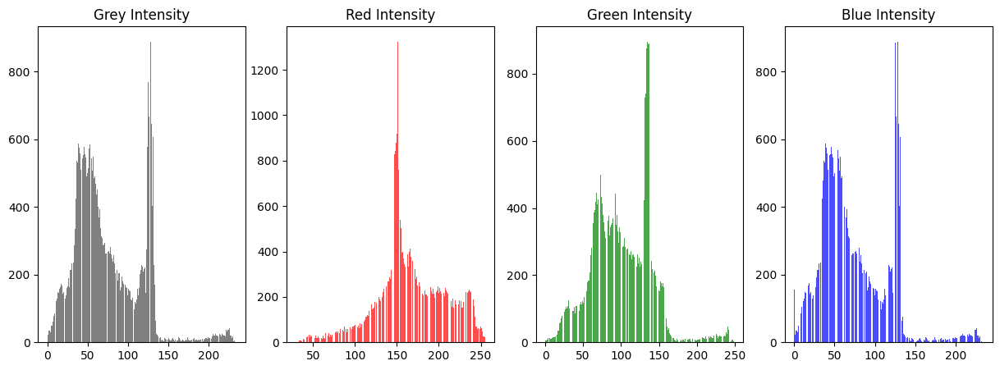

<!-- Analysis of your dataset -->

### Clustering
The **[Elbow Method](./Results/Visualization/Distortion_Score_Elbow.png)** helped us overcome one of the biggest obstacles in clustering: deciding how many clusters to create.

#### Experimental design
<!-- Describe your experimental design and choices for the week. -->
**K-Means Clustering:**
Initially, the dataset was preprocessed to extract variables such as "age," "bmi," "children," and "smoker" that were pertinent for clustering. The KElbowVisualizer was used to calculate the ideal number of clusters, and K-Means clustering was then used using the selected cluster count. To see the clusters and their centers, scatter plots were created. (Na, Xumin, & Yong, 2010)

**Hierarchical Clustering:**
Then Hierarchical clustering was conducted using Ward's method with different linkage strategies, including single, complete, average, and ward. Dendrograms were generated to illustrate the hierarchical relationships between data points.

* **Agglomerative Clustering:**
Agglomerative clustering was performed on selected features, namely 'age', 'bmi', 'children', and 'smoker'. The resulting clusters were visualized with a scatter plot, and a dendrogram was generated to display the hierarchical relationships.

* **DBSCAN Clustering:**
DBSCAN clustering was applied to the scaled data with specified parameters for epsilon (eps) and minimum samples (min_samples).

* **KModes Clustering** was also performed using Huang initialization method. As suggested above in Elbow Method, we decided to divided the data into 5 Clusters. Then, the Algorithm was run 10 times to find the most stable solution.

#### Results
<!-- Tables showing the results of your experiments -->
* This is the graph showing the spliting of data into 5 clusters based on the KMeans Clustering Algorithm.
  **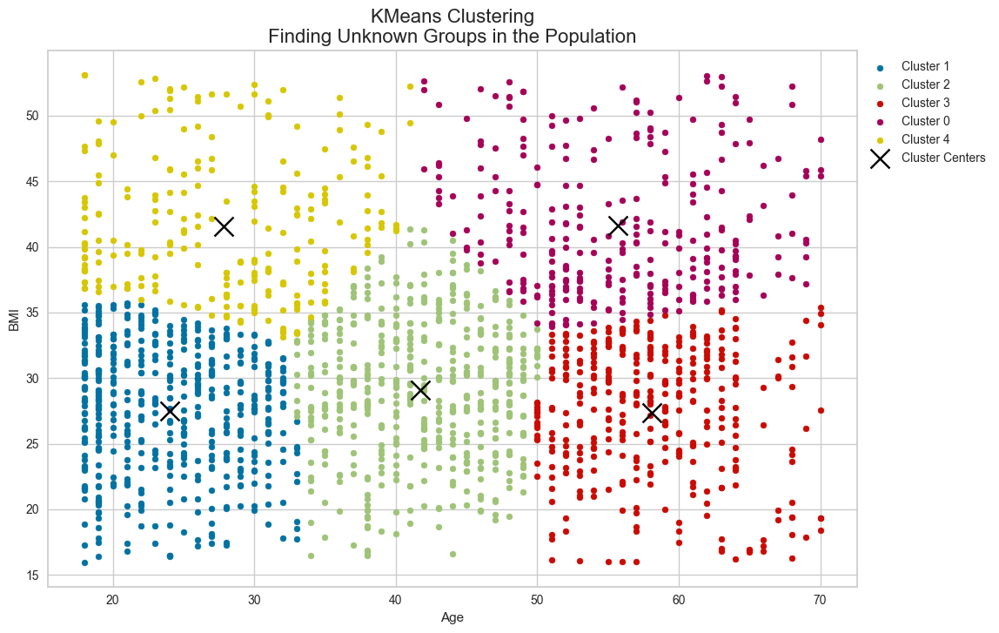**

*  **Agglomerative Clustering** has grouped the data into 5 clusters. The dendrogram visualizes the hierarchical nature of these clusters.
  **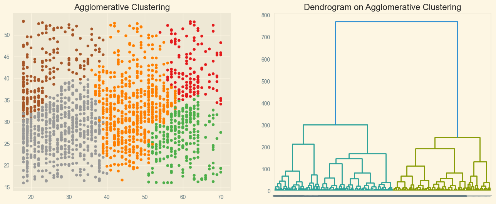**

* **[Hierarchical Clustering](./Results/Clustering/Heirarchial/hhr_clu_ddg.png)** algorithm has grouped the data into two clusters, as visualized in the dendrogram.

* **[DBSCAN Clustering](./Results/Clustering/DBSCAN/dbs_clu.png)** algorithm has grouped the data into clusters based on BMI and charges, as visualized in the scatter plot.

* **[KModes Clustering](./Results/Clustering/K_Modes/kmo_clu.png)** : This image shows the Data splitting into 5 Clusters based on KModes Clustering Algorithm.

#### Discussion
<!-- A brief discussion on the results of your experiment -->

* KMeans Clustering identifies groups based on 'Age' and 'BMI'. Each cluster represents population with similar characteristics. This enables us to find patterns and perform segmentation within the dataset. (Jin & Han, 2011)

* Based on the above results between KMeans and KModes, we can consider that KMeans is much better than KModes. KModes generates mixed clusters, this is because KModes doesn't perform good for Numerical Data (which is our case here). And hence, KMeans provides much more promising results than KModes.

* Hirarchichal Clustering only creates two clusters, K-Means and Agglomerative are able to get 5 clusters, which is more suitable for our dataset.

### Decision Trees
While exploring for Decision Tree, the approach moves towards using differenet regression models:
1. Random Forest : An ensemble learning method that uses multiple decision trees to improve predicting performance. (IBM, 2023).
2. XGBoost : An efficient and accurate gradient boosting implementation that has been optimised and scaled (Nvidia, n.d.).
  * **Note:** Gradient boosting is an ensemble learning strategy that sequentially creates a sequence of weak learners, typically decision trees. (Wikipedia Contributors, 2019).
3. Support Vector Regressor : A model capable of capturing complicated relationships in data, especially for non-linear patterns (GeeksforGeeks, 2023).
4. K-Nearest Neighbors : A non-parametric, instance-based learning technique for predicting proximity (IBM, 2023b)(Ranjan, Verma & Radhika 2019).
5. Logistic Regression : A linear model ideal for binary classification problems that provides insights into variable relationships (Subasi, 2020).
6. Descision Tree : A decision tree is a prediction model that maps characteristics to outcomes by recursively partitioning data at each node based on the most important property. (scikit-learn, 2009).

We use these regression models, as we need to predict charges, which is a continious variable.
#### Experimental design
* A train-test split is implemented with a test size of 0.25, allocating 75% of the data for training.
* [Pipelines](./notebooks/code.ipynb#Pipeline-Creation-for-the-models)(Xin et al.)(Occhipinti et al.) are created for specific regressors, including RandomForestRegressor, DecisionTreeRegressor, XGBRegressor, SVM, KNeighborsRegressor, and LogisticRegression.
* The regressor selection is based on the continuous nature of the 'charges' column.
* Pipelines ensure uniformity in preprocessing steps and modeling across different algorithms.
* Model training involves regressor selection, feature scaling, and hyperparameter tuning using GridSearchCV.
* [GridSearchCV](./notebooks/code.ipynb#GridSearch-CV-for-each-Pipeline)(Shah)(Ranjan, Verma & Radhika 2019) is performed individually for each regressor to find optimal hyperparameters.
* The [best parameters](./notebooks/code.ipynb#Passing-the-best-parameters-to-the-models) are then used to fit each pipeline on the training data.
* The evaluation phase employs chosen metrics to assess model performance on the testing set.
* Comparative analysis is conducted to select the best-performing regressor for predicting the continuous 'charges' variable.

### Hyperparameters table
**Following is the range of values for each hyper-parameters for models over which the model performs GridSearchCV:**

| Model                    | Hyperparameter                    | Values                          |
|--------------------------|-----------------------------------|---------------------------------|
| Random Forest            | n_estimators                      | [100, 250, 300, 450]            |
|                          | min_samples_leaf                  | [0.1, 0.16, 0.2, 0.26]          |
| XGBoost                  | max_depth                         | [2, 6, 8, 10]                   |
|                          | n_estimators                      | [50, 100, 125, 150]             |
|                          | learning_rate                     | [0.01, 0.03, 0.04, 0.06]        |
| Support Vector Regressor | kernel                            | ['linear', 'rbf']               |
|                          | C                                 | [0.1, 1, 5, 10]                 |
| K-Nearest Neighbors      | n_neighbors                       | [5, 7, 9, 11]                   |
|                          | leaf_size                         | [5, 10, 20, 30]                 |
| Logistic Regression      | max_iter                          | [60, 100, 120, 150]             |
| Decision Tree            | max_depth                         | [3, 5, 7, 8]                    |
|                          | min_samples_split                 | [2, 3, 4, 6]                    |

**Model Evaluation and Comparison Process:**
* Regression Models with the best parameters obtained from GridSearchCV are added to a dictionary.
* [Model Evaluation](./notebooks/code.ipynb#Models-Training-and-Evaluation) is performed on the regression models to analyse each model's performance using metrics such as Mean Squared Error, Accuracy, R2 Score, and Adjusted R2 Score.
* Train the models and determine their learning curves.
* Visualise and compare the results to compare the performance of each regression model.

#### Results
* For the Hyperparameter tuning through GridSearchCV

| Regression Model     |	Hyperparameter    | Value    |
|----------------------|--------------------|----------|
| Random Forest        | min_samples_leaf   | 0.1      |
|                      | n_estimators       | 100      |
| XGBoost              | learning_rate	    | 0.06     |
|                      | max_depth          | 2        |
|                      | n_estimators       | 150      |
| SVM                  | C                  | 10       |
|                      | kernel             | rbf      |
| KNN                  | leaf_size          | 5        |
|                      | n_neighbor         | 9        |
| Decision Tree        | max_depth          | 5        |
|                      | min_samples_split  | 6        |
| Linear Regression    | max_iter           | 60       |

<!-- Tables showing the results of your experiments -->
#### Results
* For the models after Evaluation (Tai, 2021)(“List of Evaluation Metrics for Classification and Regression”)

| Regression Model     | Mean Squared Error | R2-Score | Adjusted R2 Score |
|----------------------|--------------------|----------|-------------------|
| Random Forest        | 162499.381         | 0.4253   | 0.4177            |
| XGBoost              | 136980.79          | 0.515    | 0.5092            |
| SVM                  | 157633.401         | 0.443    | 0.4352            |
| KNN                  | 147982.06          | 0.4765   | 0.4697            |
| Decision Tree        | 135791.64          | 0.5197   | 0.5134            |
| Linear Regression    | 146863.24          | 0.48     | 0.4737            |

**Mean Squared Error For each Model:**
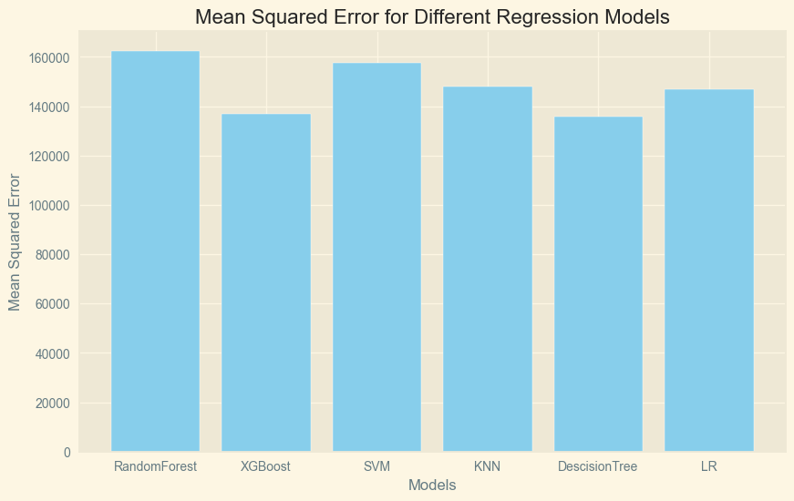

**R2-Score For each Model:**
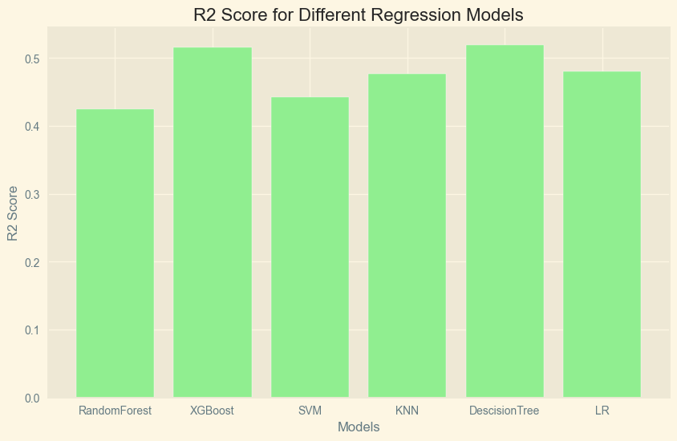

#### Discussion
<!-- A brief discussion on the results of your experiment -->
* For GridSearchCV the [range of values](README.md#hyperparameters-table) used sufficently tells the best parameters lie within the upper and lower values, suggesting the correctnedd of ranges suggested to be processed for hyperparameter tuning.
* After the GridSearchCV, the processed best parameters are shown in the [table](README.md#results-1). The list shows which best parameters are fit for which model and should be used to implement model evaluation.
* In the [results](README.md#results-2) it is observed that the mean squared error for Descision Tree Regression is the minimum (135791.64). Also, the R2-Score (0.5197) and Adjusted R2-Score (0.5134) is the best/highest for Descision Tree. This makes it the best model to be choosen for testing on new data.
* While comparing the [learning curves](./Results/Modelling/) of each model, it is observed that [Descision Tree](./Results/Modelling/DF.png) performs really well compared to others.
* A key observation that comes to notice is that [XGBoost](./Results/Modelling/XGBoost.png) also peforms almost as well as the Descision Tree. The mean squared error (136980.79), R2-Score (0.515) and Adjusted R2-Score (0.5092) are as close to that of the Descision Tree.
### Neural Networks

#### Experimental design
<!-- Describe your experimental design and choices for the week. -->
* Initially we started this process by creating a specific function, which aids in extracting data from the given UTK Face Datset. These are present as a text which defines the path of the image. And using this function, we were able to display the image.

* Our convolutional neural network (CNN) (Browne and Ghidary) architecture is precision-structured for the experimental design to optimise feature extraction and predicting performance. The model starts with a shape input layer (64, 64, 1), then three convolutional layers (Conv2D) with decreasing size. Layers in MaxPooling reduce spatial dimensions, increasing computational performance. Dropout layers are intentionally placed to avoid overfitting. The Flatten layer flattens the output of dense layers, which are made up of varied nodes for feature representation. The model closes with two output layers: 'age_output' and 'gender_output', which predict age and gender, respectively (“Image Classification Using CNN : Python Implementation”)(S. Haldar, 2019).

* Then, we compiled the neural network using the 'Adam' optimizer with dual outputs:
  - Predicting Age (Using Mean squared Error Loss)
  - Predicting Gender (Using Binary Crossentropy Loss)
This was performed whilst tracking mean absolute error and accuracy metrics.

* Then using Data Generator function we created earlier, we now create generators for training and testing datasets.

* In the next step, we train the model using the training dataset and validate it over test dataset for 50 Epochs.

* We then plot a Validation Loss Graph, which represents the model's performance during training.

* As training the model using CNN takes a lot of time, we save it in a H5 format. This allows us to reuse it later without having to train the model again and deploy it in a production environment directly.

#### Results

**The CNN architechture (“CNN Image Classification | Image Classification Using CNN”) based on the experimental Design can be given as:**

| Layer (type)                   | Output Shape       | Param #   | Connected to                   |
|---------------------------------|---------------------|-----------|---------------------------------|
| input_2 (InputLayer)           | (None, 64, 64, 1)   | 0         | []                              |
| conv2d_3 (Conv2D)              | (None, 62, 62, 32)  | 320       | ['input_2[0][0]']               |
| conv2d_4 (Conv2D)              | (None, 60, 60, 64)  | 18,496    | ['conv2d_3[0][0]']              |
| max_pooling2d_2 (MaxPooling2D)  | (None, 30, 30, 64)  | 0         | ['conv2d_4[0][0]']              |
| conv2d_5 (Conv2D)              | (None, 28, 28, 128) | 73,856    | ['max_pooling2d_2[0][0]']       |
| max_pooling2d_3 (MaxPooling2D)  | (None, 14, 14, 128) | 0         | ['conv2d_5[0][0]']              |
| dropout_11 (Dropout)           | (None, 14, 14, 128) | 0         | ['max_pooling2d_3[0][0]']       |
| flatten_1 (Flatten)            | (None, 25088)      | 0         | ['dropout_11[0][0]']            |
| dense_10 (Dense)               | (None, 128)        | 3,211,392 | ['flatten_1[0][0]']             |
| dense_15 (Dense)               | (None, 128)        | 3,211,392 | ['flatten_1[0][0]']             |
| dropout_12 (Dropout)           | (None, 128)        | 0         | ['dense_10[0][0]']              |
| dropout_17 (Dropout)           | (None, 128)        | 0         | ['dense_15[0][0]']              |
| dense_11 (Dense)               | (None, 64)         | 8,256     | ['dropout_12[0][0]']            |
| dense_16 (Dense)               | (None, 64)         | 8,256     | ['dropout_17[0][0]']            |
| dropout_13 (Dropout)           | (None, 64)         | 0         | ['dense_11[0][0]']              |
| dropout_18 (Dropout)           | (None, 64)         | 0         | ['dense_16[0][0]']              |
| dense_12 (Dense)               | (None, 32)         | 2,080     | ['dropout_13[0][0]']            |
| dense_17 (Dense)               | (None, 32)         | 2,080     | ['dropout_18[0][0]']            |
| dropout_14 (Dropout)           | (None, 32)         | 0         | ['dense_12[0][0]']              |
| dropout_19 (Dropout)           | (None, 32)         | 0         | ['dense_17[0][0]']              |
| dense_13 (Dense)               | (None, 16)         | 528       | ['dropout_14[0][0]']            |
| dense_18 (Dense)               | (None, 16)         | 528       | ['dropout_19[0][0]']            |
| dropout_15 (Dropout)           | (None, 16)         | 0         | ['dense_13[0][0]']              |
| dropout_20 (Dropout)           | (None, 16)         | 0         | ['dense_18[0][0]']              |
| dense_14 (Dense)               | (None, 8)          | 136       | ['dropout_15[0][0]']            |
| dense_19 (Dense)               | (None, 8)          | 136       | ['dropout_20[0][0]']            |
| dropout_16 (Dropout)           | (None, 8)          | 0         | ['dense_14[0][0]']              |
| dropout_21 (Dropout)           | (None, 8)          | 0         | ['dense_19[0][0]']              |
| age_output (Dense)             | (None, 1)          | 9         | ['dropout_16[0][0]']            |
| gender_output (Dense)          | (None, 1)          | 9         | ['dropout_21[0][0]']            |

 This CNN architecture, which has a total of 6,537,474 trainable parameters, is designed to balance complexity and interpretability in the context of our predicting tasks.

The models train and validation loss can be visualised through this plot of Loss over Epochs.

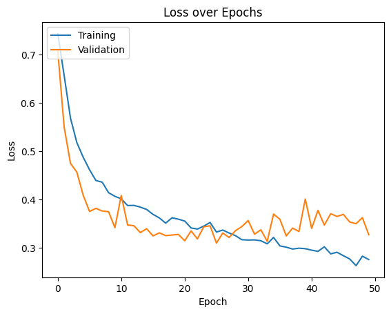

* **Gender Model Accuracy**: 0.8851351141929626
* **Age Model Mean Absolute Error**: 0.12831860780715942

* **Testing the data on new image:**

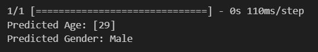
<!-- Tables showing the results of your experiments -->
NOTE: The CNN Model is uploaded on OneDrive and anyone with the Heriot-Watt email id can access the model.
#### Discussion
<!-- A brief discussion on the results of your experiment -->

* We can see that the CNN model performs really well prediciting the given new image. We gave an image that had the original age of 31 and Gender as male. Our CNN model predicts it as 29, Male which is a pretty accurate prediction.
* The accuracy of these predictions depends a lot on the quality of the images. Clear and distinct images give more accurate results, but the model struggles when faced with lower-quality or unclear pictures. The predicted age may vary a little but not much.
* Gender being a binary classifiication, it is predicted correctly. These results make the model ready to be integrated with the final regression model.

### Conclusion
<!-- Final conclusions regarding your initial objectives -->
We have merged the output model for Convolution Neuaral Network for predicting the age and gender of a person from image with the best Regression Model.
* We have created a user interface in python that allows user to input image (for time being in a directory as jpg and then passing as a path) that gets us the age and gender.
* The next step is asking user for theit BMI, How many Children they have, is the user a smoker or not and the region they belong to.
* After this the user is prompted to provide their name.

Based on these input variables, we run it through the best regression model - in our case : [Descision Forest](README.md#discussion-1) - and then give the predicted Insurance Premium. Some tweaks are done in the data for the BMI based weight category calculation using the formula mentioned in the [data wrangling section - point4](README.md#data-wrangling). This adds more value to the final output. Just for the project, to give a real scenario the output shows the premium in GBP (£).

* **A sample User Interface looks like this:**
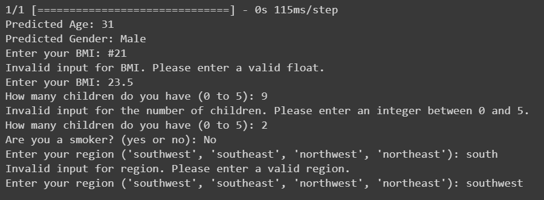
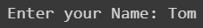

* **A sample output looks like this:**
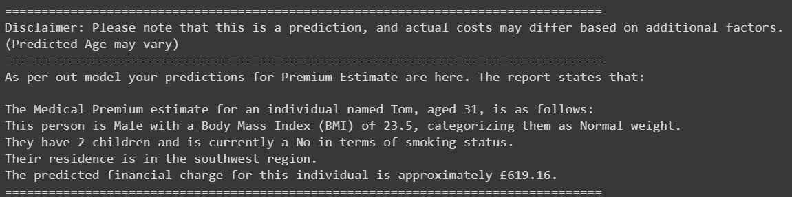

As it can be seen that the model predicts the Insurance Premium that the user is entitled to by using the Variables given. This is a pretty close prediction of the Premium.

As discussed in the [Neural Network Section](README.md#discussion-2), the limitations held up are that the age might not be predicted by the model as to the true value. But this may be due to the quality of image. For that reason a disclaimer is given so that the user is made known of the issue. The gender being a binary classification, has shown promissing results and been predicted correctly by the CNN model.

Final Comments:
The Regression Model Performs well on the test data and also CNN model has shown excellent results. The data output varies with the user's input for the interface. The data can be predicted for inputs:

**Autodetected using CNN**
* Age
* Gender : Male or Female

**User Input**
* BMI under 100
* Children from 0 to 5
* Smoker : Yes or No
* Region: southwest, southeast, northwest, northeast

The Predicted premium using the Descision Forest is given accordingly in GBP (£).

# References
NHS inform. (n.d.). Body mass index (BMI). [online] Available at: https://www.nhsinform.scot/healthy-living/food-and-nutrition/healthy-eating-and-weight-loss/body-mass-index-bmi/#:~:text=BMI%20ranges&text=under%2018.5%20%E2%80%93%20This%20is%20described.

IBM (2023). What is Random Forest? | IBM. [online] www.ibm.com. Available at: https://www.ibm.com/topics/random-forest.

Nvidia (n.d.). What is XGBoost? [online] NVIDIA Data Science Glossary. Available at: https://www.nvidia.com/en-us/glossary/data-science/xgboost/.

Wikipedia Contributors (2019). Gradient boosting. [online] Wikipedia. Available at: https://en.wikipedia.org/wiki/Gradient_boosting.

GeeksforGeeks. (2023). Support Vector Regression (SVR) using Linear and Non-Linear Kernels in Scikit Learn. [online] Available at: https://www.geeksforgeeks.org/support-vector-regression-svr-using-linear-and-non-linear-kernels-in-scikit-learn/.

IBM (2023). What is the k-nearest neighbors algorithm? | IBM. [online] www.ibm.com. Available at: https://www.ibm.com/topics/knn.

Subasi, A. (2020). Chapter 3 - Machine learning techniques. [online] ScienceDirect. Available at: https://www.sciencedirect.com/science/article/abs/pii/B9780128213797000035.

Occhipinti, Annalisa, et al. “A Pipeline and Comparative Study of 12 Machine Learning Models for Text Classification.” Expert Systems with Applications, vol. 201, Sept. 2022, p. 117193, https://doi.org/10.1016/j.eswa.2022.117193.

Xin, Doris, et al. “Production Machine Learning Pipelines: Empirical Analysis and Optimization Opportunities.” ArXiv.org, 29 Mar. 2021, arxiv.org/abs/2103.16007.

G. S. K. Ranjan, A. Kumar Verma and S. Radhika, "K-Nearest Neighbors and Grid Search CV Based Real Time Fault Monitoring System for Industries," 2019 IEEE 5th International Conference for Convergence in Technology (I2CT), Bombay, India, 2019, pp. 1-5, doi: 10.1109/I2CT45611.2019.9033691.

Shah, Rahul. “GridSearchCV |Tune Hyperparameters with GridSearchCV.” Analytics Vidhya, 23 June 2021, www.analyticsvidhya.com/blog/2021/06/tune-hyperparameters-with-gridsearchcv/.

scikit-learn (2009). 1.10. Decision Trees — scikit-learn 0.22 documentation. [online] Scikit-learn.org. Available at: https://scikit-learn.org/stable/modules/tree.html.

Tai, Yunpeng (2021). “A Survey of Regression Algorithms and Connections with Deep Learning.” ArXiv.org, 26 Apr. 2021, arxiv.org/abs/2104.12647.

“List of Evaluation Metrics for Classification and Regression.” DEV Community, 6 Mar. 2021, dev.to/amananandrai/list-of-evaluation-metrics-for-classification-and-regression-1h27.

Browne, Matthew, and Saeed Shiry Ghidary. “Convolutional Neural Networks for Image Processing: An Application in Robot Vision.” Lecture Notes in Computer Science, 2003, pp. 641–652, https://doi.org/10.1007/978-3-540-24581-0_55.

“Image Classification Using CNN : Python Implementation.” Analytics Vidhya, 14 June 2021, www.analyticsvidhya.com/blog/2021/06/image-classification-using-convolutional-neural-network-with-python/

“CNN Image Classification | Image Classification Using CNN.” Analytics Vidhya, 18 Feb. 2020, www.analyticsvidhya.com/blog/2020/02/learn-image-classification-cnn-convolutional-neural-networks-3-datasets/.

S. Haldar, "Design and Implementation of an Image Classifier using CNN," 2019 3rd International Conference on Computing Methodologies and Communication (ICCMC), Erode, India, 2019, pp. 1012-1017, doi: 10.1109/ICCMC.2019.8819765.

Jin, X., Han, J. (2011). K-Means Clustering. In: Sammut, C., Webb, G.I. (eds) Encyclopedia of Machine Learning. Springer, Boston, MA. https://doi.org/10.1007/978-0-387-30164-8_425

S. Na, L. Xumin and G. Yong, "Research on k-means Clustering Algorithm: An Improved k-means Clustering Algorithm," 2010 Third International Symposium on Intelligent Information Technology and Security Informatics, Jian, China, 2010, pp. 63-67, doi: 10.1109/IITSI.2010.74.

Stratos Idreos, Olga Papaemmanouil, and Surajit Chaudhuri. 2015. "Overview of Data Exploration Techniques." In Proceedings of the 2015 ACM SIGMOD International Conference on Management of Data (SIGMOD '15), 277–281. New York, NY, USA: Association for Computing Machinery. https://doi.org/10.1145/2723372.2731084

Zuur, A.F., Ieno, E.N., and Elphick, C.S. (2010) "A protocol for data exploration to avoid common statistical problems." Methods in Ecology and Evolution, 1, 3-14. https://doi.org/10.1111/j.2041-210X.2009.00001.x
